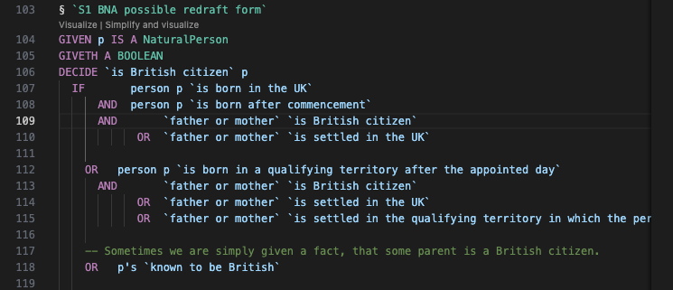
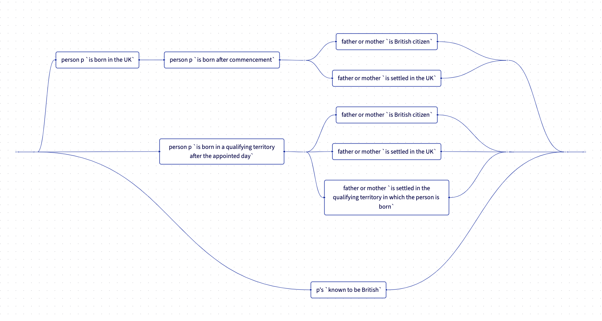

# L4 with IDE

**L4** is a domain-specific programming language for law, designed to bring software engineering rigor to legal drafting and contract analysis. Just as programmers have powerful IDEs, compilers, debuggers, and test suites, L4 provides legal professionals with a comprehensive toolchain for creating precise, unambiguous, and verifiable legal specifications.

## What is L4?

L4 treats legal rules and contracts as **executable specifications** rather than documents. Drawing from logic programming, functional programming, temporal logic, and formal verification, L4 allows you to:

- **Formalize** legal rules with mathematical precision
- **Test** contracts against scenarios before deployment
- **Find** logical contradictions and loopholes automatically
- **Generate** user-facing web applications from legal specifications
- **Explain** decisions with audit-grade evaluation traces
- **Integrate** with enterprise systems via REST APIs

This repository includes the L4 compiler toolchain, IDE extensions for Visual Studio Code, an interactive REPL, a web-based editor, visualization tools, and a decision service for runtime evaluation.

## Real-World Impact

L4 has been piloted with organizations in both public and private sectors:

- **Government Regulatory Compliance**: Encoded secondary legislation to auto-generate web wizards that explain legal obligations to citizens. Formal verification discovered a race condition—a double bind where contradictory clauses could require and prohibit the same action simultaneously.

- **Insurance Policy Analysis**: Formalized insurance contracts from major global providers, discovering ambiguities in payout formulas that potentially caused millions of dollars in claims leakage.

- **Legislative Drafting**: Working with government legal drafting offices on rules-as-code initiatives, enabling legislation to be written in machine-verifiable form from the start.

- **Commercial Agreements**: Transformed complex fee schedules and payment terms into L4, serving them via SQL-like APIs for enterprise system integration.

## Documentation

### For Developers

- **[doc/dev/setup.md](./doc/dev/setup.md)** - Complete developer setup guide for Haskell and TypeScript development
- **[doc/dev/local-config.md](./doc/dev/local-config.md)** - Local development guide (running with `cabal`)
- **[dev-start.sh](./dev-start.sh)** - Helper script for starting services locally

### For DevOps

- **[doc/dev/deployment/provisioning.md](./doc/dev/deployment/provisioning.md)** - Setting up new servers from scratch (nixos-anywhere)
- **[doc/dev/deployment/deployment.md](./doc/dev/deployment/deployment.md)** - Deploying to existing dev/prod servers
- **[nix/README.md](./nix/README.md)** - NixOS configuration reference

## Gallery

Syntax Highlighting for Boolean-oriented decision logic



Decision Logic Visualization as a ladder diagram circuit



## Trace Visualization

Curious how an L4 decision actually unfolded? Every tool in this repo can show you the evaluation trace as a GraphViz diagram:

- **CLI:** `jl4-cli --graphviz myfile.l4 > trace.dot`, then render with `dot -Tsvg trace.dot > trace.svg`.
- **REPL:** Load a file, run `:trace your expression`, or turn on `:tracefile traces/session` to capture numbered `.dot` files with timestamps, imports, and the final result right in the header.
- **Decision Service:** Call `POST /functions/<name>/evaluation?trace=full&graphviz=true` to get a `graphviz` object containing the DOT plus relative PNG/SVG URLs, or hit `evaluation/trace.png` / `trace.svg` directly for ready-to-share images. Batch requests set `graphviz=true` to attach an `@graphviz` blob (same `{dot,png,svg}` shape) per case.

These traces act like explainability receipts for deterministic logic: you can follow each node from the top-level question down to the exact condition or branch that determined the answer. Install GraphViz (`brew install graphviz` or `apt-get install graphviz`) to unlock the PNG/SVG outputs.

## Trace Logging

L4 provides audit-grade explainability and observability. Textual decision traces can be generated in plain text or JSON for archival purposes.

## Status (December 2025)

### Core Language Features ✅

- ✅ Functional core with layout-sensitive parsing
- ✅ LET...IN expressions with Haskell-style recursive bindings
- ✅ Mixfix and postfix operators for domain-specific syntax
- ✅ Pattern matching for function definitions (in development)
- ✅ Type coercion builtins (TOSTRING, TONUMBER, TODATE, TRUNC)
- ✅ String manipulation primitives (SPLIT, CHARAT, CONCAT)
- ✅ Math library with trigonometric functions (SQRT, EXPONENT, etc.)
- ✅ Dictionary/map data structures in prelude
- ✅ HTTP operations (POST, FETCH) for external API integration
- ✅ JSON operations (JSONENCODE, JSONDECODE) with bidirectional type checking
- ✅ Excel date compatibility for business applications
- ✅ Temporal logic with multi-temporal evaluation contexts
- ✅ Application libraries (jurisdiction, currency, legal persons, holdings)

### IDE & Developer Tools ✅

- ✅ VS Code extension with syntax highlighting, type checking, and inline evaluation
- ✅ LSP server with hover support for @desc annotations
- ✅ Interactive REPL (jl4-repl) for live code exploration
- ✅ Web-based editor at https://jl4.legalese.com/
- ✅ CLI tool (jl4-cli) with unified GraphViz output control

### Trace Visualization & Explainability ✅

- ✅ GraphViz evaluation trace visualization (Phase 1 complete)
- ✅ Function body display with @desc semantic annotations
- ✅ Conditional trace collection (controlled via CLI flags and API parameters)
- ✅ Multiple output formats: DOT, PNG, SVG
- ✅ Decision logic visualizer as ladder diagram circuits
- 🚧 Binding deduplication for shared WHERE/LET clauses (WIP)

### Decision Service & APIs ✅

- ✅ REST API for decision evaluation with OpenAPI/Swagger
- ✅ @export syntax for declaring API-exposed functions (no separate YAML needed)
- ✅ Batch evaluation with parallel processing
- ✅ Module precompilation for 10-100x performance improvement
- ✅ JSON Schema generation (jl4-schema CLI)
- ✅ Websessions integration with auto-push to decision service

### In Development 🚧

- 🚧 Boolean minimization for default logic reasoning
- 🚧 TYPICALLY keyword for rebuttable presumptions
- 🚧 Runtime input state model for partial information handling
- 🚧 State transition logic visualizer (automaton view)
- 🚧 Web App Auto-Generation for Decision Logic
- 🚧 Natural language generation to Word/PDF
- 🚧 Formal verification tooling for finding logical contradictions and loopholes

## The REPL

An interactive Read-Eval-Print Loop for exploring L4 code in real-time.

```bash
jl4-repl
```

The REPL provides:

- Live evaluation of L4 expressions
- Trace visualization controls (`:trace on/off/all`, `:graphviz on/png/svg`)
- Module loading and reloading (`:load myfile.l4`)
- Interactive exploration of language features
- Output directory configuration for saving traces

Perfect for prototyping logic, testing functions, and learning L4 interactively.

## The Web Editor

An experimental prototype offers a lightweight web-based alternative to VS Code.

https://jl4.legalese.com/

## VS Code Extension: Download, Install and Build

[Dev Build](Dev.md): for Haskell and JS developers to improve the toolchain and IDE developer experience. Requires Haskell and Typscript.

[Quickstart for a local build](Quickstart.md): for legal engineers to experiment with writing L4 code locally. Download the VS Code extension and get started.

## Application Libraries

L4 includes foundational libraries for building legal and commercial applications:

- **[Jurisdiction](jl4-core/libraries/jurisdiction.l4)**: ISO 3166 country codes, US states, Canadian provinces, and supranational regions (EU). Use directly in code as string literals ("US", "GB", "SG").

- **[Currency](jl4-core/libraries/currency.l4)**: ISO 4217 currency codes (USD, EUR, GBP, JPY, etc.) with integer minor unit storage to avoid floating-point errors.

- **[Legal Persons](jl4-core/libraries/legal-persons.l4)**: Model individuals, corporations, partnerships, LLCs, and trusts with appropriate legal attributes.

- **[Holdings](jl4-core/libraries/holdings.l4)**: Ownership structures and percentage holdings for modeling corporate relationships and beneficial ownership.

These libraries follow a principle of simplicity and extensibility—they provide common patterns while allowing applications to extend them for specific needs.

## Learning L4

### [Foundation Course](doc/foundation-course-ai/)

A complete introduction to L4 for legal professionals and developers. Learn to write legal rules as executable code through hands-on modules:

- **Module 0**: Orientation & File Anatomy
- **Module 1**: Enums & Records (DECLARE)
- **Module 2**: Functions (GIVEN/GIVETH/MEANS)
- **Module 3**: Control Flow (CONSIDER, WHEN, BRANCH)
- **Module 4**: Lists, MAYBE, and Higher-Order Functions
- **Module 5**: WPA Eligibility Pipeline (complete example)
- **Module 6**: Test Data & Evaluation

**Who it's for**: Anyone new to L4, legal professionals learning to code, developers entering legal tech.

### [Advanced Course](doc/advanced-course-ai/)

Production-grade L4 development for enterprise systems. Covers professional workflows, system architecture, and integration:

- **Module A1**: VSCode Development Workflow
- **Module A2**: AI-Assisted Rule Ingestion
- **Module A3**: Temporal Logic [WIP]
- **Module A4**: Decision Service APIs
- **Module A5**: Rebuttable Presumptions [ROADMAP]
- **Module A6**: JSON Integration & External Systems
- **Module A7**: Regression Testing & Change Control
- **Module A8**: Multi-File Architecture
- **Module A9**: OPM/OIA Migration
- **Module A10**: LLM-Powered Semantic Parser / Chatbot [PLANNED]
- **Module A11**: Regulative Rules & Contract Logic

**Who it's for**: Developers building production systems, enterprise architects, teams migrating from legacy systems, developers building AI-powered legal interfaces, and developers building contract management or compliance systems.

### Other Tutorials

- [Default Logic](./doc/default-logic.md) and `Optional` types with the `Maybe` monad
- [Automatically Building User-Facing Apps](doc/apps.md)

## Language Reference & Theory

For an in-depth exploration of L4's theoretical foundations, design philosophy, and language features, see the [**L4 Language Reference**](doc/README.md).

This comprehensive guide covers:

- **Boolean logic** and data types for legal reasoning
- **Default logic** and ternary reasoning (unknown values)
- **Constitutive rules** as first-order predicate logic (decision functions)
- **Regulative rules** as labeled state transition systems (contracts, obligations)
- **Multi-temporal logic** for reasoning about time-dependent rules
- **Deontics** as property assertions (must, may, shall)
- **Design principles** and the theory behind L4's syntax
- Comparison with related languages (Catala, Blawx, Logical English, etc.)

The reference also links to detailed documents on specific topics including mixfix operators, scope and modifiers, and the semantic foundations of legal computation.
