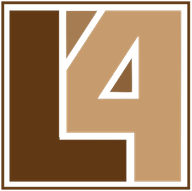

# L4 Language Documentation

Welcome to the L4 language documentation. L4 is a domain-specific language for law that enables computer-readable formalizations of contracts, legislation, and regulations.

---

## Getting Started

New to L4? Start here:

1. **[Get L4](https://marketplace.visualstudio.com/items?itemName=Legalese.l4-vscode)** - Download the VS Code extension or [code online](https://jl4.legalese.com)
2. **[Foundation Course](courses/foundation/README.md)** - Learn L4 systematically (start here!)
3. **[Your First L4 File](tutorials/getting-started/first-l4-file.md)** - Hands-on in 15 minutes

---

## Documentation Types

Our documentation is organized by **what you need**:

| Type                                 | Purpose                | When to Use                 |
| ------------------------------------ | ---------------------- | --------------------------- |
| **[Courses](courses/README.md)**     | Learning-oriented      | "Teach me L4"               |
| **[Tutorials](tutorials/README.md)** | Task-oriented          | "How do I do X?"            |
| **[Reference](reference/README.md)** | Information-oriented   | "What is X?"                |
| **[Concepts](concepts/README.md)**   | Understanding-oriented | "Why does X work this way?" |

---

## Courses

Structured learning paths from beginner to advanced:

### [Foundation Course](courses/foundation/README.md)

Learn L4 from scratch. No prior programming experience required.

- Module 0: Introduction - What is L4?
- Module 1: Your First Legal Rule
- Module 2: Legal Entities and Types
- Module 3: Control Flow
- Module 4: Functions
- Module 5: Regulative Rules (Obligations & Permissions)
- Module 6: Capstone Project

**Time:** ~4-6 hours total

### [Advanced Course](courses/advanced/README.md)

Deep dives for production use.

- Module A1: Real Regulatory Schemes
- Module A2: Cross-Cutting Concerns
- Module A3: Complex Contracts
- Module A4: Production Patterns

**Prerequisites:** Foundation Course

---

## Tutorials

Task-focused guides for specific goals:

### Getting Started

- [Your First L4 File](tutorials/getting-started/first-l4-file.md) - Create, run, test (15 min)
- [Encoding Legislation](tutorials/getting-started/encoding-legislation.md) - Turn legal text into L4 (30 min)
- [Wedding Vows Example](tutorials/getting-started/wedding-vows.md) - Fun intro to regulative rules (20 min)
- [Common Patterns](tutorials/getting-started/common-patterns.md) - Quick reference (30 min)

### LLM Integration

- [Getting Started with LLM](tutorials/llm-integration/llm-getting-started.md) - Hybrid AI + formal reasoning
- [Legislative Ingestion](tutorials/llm-integration/legislative-ingestion.md) - LLM-assisted encoding

[View all tutorials →](tutorials/README.md)

---

## Reference

Look up specific features:

- **[Syntax Reference](reference/syntax/README.md)** - Complete syntax guide
- **[Types](reference/types/README.md)** - L4 Types
- **[Functions](reference/functions/README.md)** - Functions as rules
- **[Regulative](reference/regulative/README.md)** - Regulative language
- **[Libraries](reference/libraries/README.md)** - Standard library
- **[Operators](reference/operators/README.md)** - Operators and precedence

[View full reference →](reference/README.md)

---

## Concepts

Understand the "why" behind L4:

- **[Design Principles](concepts/language-design/principles.md)** - Why L4 works this way
- **[Regulative Rules](concepts/legal-modeling/regulative-rules.md)** - Obligations, permissions, prohibitions
- **[Algebraic Types](concepts/type-system/algebraic-types.md)** - L4's type system

[View all concepts →](concepts/README.md)

---

## Community & Support

- **[Discord](https://discord.gg/Q7a7NSEdNy)** - Chat with the community
- **[GitHub Issues](https://github.com/smucclaw/l4-ide/issues)** - Report bugs, request features
- **[Legalese Services](https://legalese.com)** - Professional implementation services

---

## More Resources

- **[L4 IDE Repository](https://github.com/smucclaw/l4-ide)** - Source code
- **[Example Code](https://github.com/smucclaw/l4-ide/tree/main/jl4/examples)** - Working examples
- **[Experiments](https://github.com/smucclaw/l4-ide/tree/main/jl4/experiments)** - Real-world encodings
