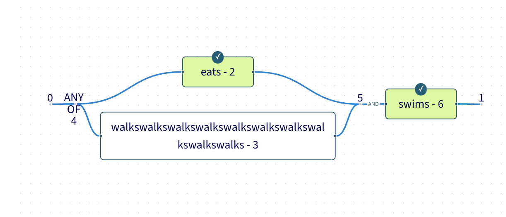

# How to debug the no intermediate bundling node dag stuff

The nice thing about the graphs is that they can be debugged in visual ways.

I.e., if you're trying to understand or debug this stuff, it might help to do the following. (It should be possible to throw this doc into an LLM agent and get it to do the following setup.)

## Annotate uboolvar nodes with LirId info so it's easier for you to see which LirID corresponds to which bundling node, e.g. with

```ubool-var.svelte
      <button
        class="label-wrapper-for-content-bearing-sf-node cursor-pointer"
        onclick={() => {
          const ladderGraph = ladderEnv
            .getTopFunDeclLirNode(data.context)
            .getBody(data.context)
          const node = data.context.get(data.originalLirId) as UBoolVarLirNode
          // ....

        }}
      >
        {data.name.label} - {data.originalLirId.toString()}
      </button>
```

## Similarly, annotate bundling nodes with their LirIds

```bundling-source.svelte (and similarly with bundling-sink.svelte)
  {#if !data.context.shouldEnableZenMode()}
    <div class={['node-annotation', ...data.classes]}>
      {data.annotation}
      {data.originalLirId.toString()}
    </div>
  {/if}
```

## You should then be able to navigate to the localhost routes (cd into visualizer dir and `corepack npm run dev`) and see something like the following


