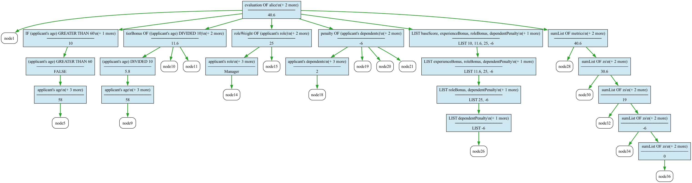

# Decision Service Backend

Exposes L4 programs for use by LLM AI agents via the Tool Calling / Function Calling API.

## Current Features

The decision service supports multiple ways to load and manage L4 functions:

1. **Hardcoded examples** - A few demonstration functions are built-in for testing (see `src/Examples.hs`)
2. **Dynamic loading from disk** - L4 files can be loaded at startup via `--sourcePaths` (see "Loading L4 Functions" below)
3. **Runtime function management** - Functions can be created, updated, and deleted via REST API while the service is running

4. **Query planning** - Intelligent elicitation support to determine which inputs to ask for next
5. **State graph extraction** - Visualize contract state machines from regulative rules (MUST/MAY/SHANT/DO)

## Planned Features

- Improved error messages and validation feedback
- Additional evaluation backends beyond JL4

## Usage

Run the decision service backend locally from the project root:

```sh
> cabal run jl4-decision-service-exe -- --port 8081 --serverName http://localhost:8081/ --sourcePaths jl4/experiments/britishcitizen5.l4 --sourcePaths jl4/experiments/parking.l4
```

or run it from the sub-directory:

```sh
> cd jl4-decision-service
> cabal run jl4-decision-service-exe -- --port 8081 --serverName http://localhost:8081/ --sourcePaths ../jl4/experiments/britishcitizen5.l4 --sourcePaths ../jl4/experiments/parking.l4
```

Then try executing a few things [swagger-ui at http://localhost:8081/swagger-ui/](http://localhost:8081/swagger-ui/).
There is also a machine-readable [`swagger.json`](http://localhost:8081/swagger.json) representation of the API.

### Endpoints

#### Functions resource

The function resource represents functions in the `jl4-decision-service`.
These functions can be evaluated with user-given arguments.

- `GET    /functions`: Get the function signature of all stored functions
- `GET    /functions/<name>`: Get the full function signature of the function `<name>`
- `PUT    /functions/<name>`: Update the function `<name>` with new L4 code
- `POST   /functions/<name>`: Create a new function `<name>` with L4 code
- `DELETE /functions/<name>`: Delete function `<name>`

#### Runtime Function Management

Functions can be dynamically created and updated while the service is running. To create a new function, POST to `/functions/<name>` with a JSON payload containing the function declaration and L4 implementation:

```bash
curl -X POST 'http://localhost:8081/functions/my_new_function' \
  -H 'Content-Type: application/json' \
  -d '{
    "declaration": {
      "type": "function",
      "function": {
        "name": "my_new_function",
        "description": "A dynamically created function",
        "parameters": {
          "type": "object",
          "properties": {
            "x": {
              "type": "number",
              "description": "Input value"
            }
          },
          "required": ["x"]
        },
        "supportedBackends": ["jl4"]
      }
    },
    "implementation": {
      "jl4": "GIVEN x IS A NUMBER\nGIVETH A NUMBER\nDECIDE my_new_function IS x + 1"
    }
  }'
```

Use `PUT` to update an existing function with the same JSON structure. Use `DELETE` to remove a function from the service.

### Evaluation

Function evaluation is provided via the endpoints:

- `POST  /functions/<name>/evaluation`: Evaluate the function `<name>` with given arguments.
- `POST  /functions/<name>/batch`: Evaluate the function `<name>` with an array of arguments.

#### Controlling Trace Output

By default, evaluation returns only the result. To include a full execution trace, use either:

- **Query parameter**: `?trace=full`
- **HTTP header**: `X-L4-Trace: full`

The header takes precedence if both are provided. Valid values are `none` (default) and `full`.

```bash
# Using query parameter
curl -X POST 'http://localhost:8081/functions/compute_qualifies/evaluation?trace=full' \
  -H 'Content-Type: application/json' \
  -d '{"fnArguments":{"walks": true, "drinks": true, "eats": true}}'

# Using header
curl -X POST 'http://localhost:8081/functions/compute_qualifies/evaluation' \
  -H 'Content-Type: application/json' \
  -H 'X-L4-Trace: full' \
  -d '{"fnArguments":{"walks": true, "drinks": true, "eats": true}}'
```

### Visualizing Evaluation Traces

New to L4? You can now see how your logic flows by asking the decision service for a GraphViz trace. Start with `trace=full` so the engine records every lazy step, then toggle `graphviz=true` to include DOT output plus ready-made image links in the JSON response:

```bash
curl -s \
  'http://localhost:8081/functions/compute_qualifies/evaluation?trace=full&graphviz=true' \
  -H 'Content-Type: application/json' \
  -d '{"fnEvalBackend":"JL4","fnArguments":{"walks": true, "drinks": true, "eats": true}}' \
  | jq '.contents.graphviz'
```

`graphviz` is now an object with three helpful fields:

```jsonc
"graphviz": {
  "dot": "digraph evaluation_trace { ... }",
  "png": "/functions/compute_qualifies/evaluation/trace.png",
  "svg": "/functions/compute_qualifies/evaluation/trace.svg"
}
```

If you prefer pictures, the service can render the same trace as PNG or SVG when GraphViz’ `dot` binary is on your path (e.g. `brew install graphviz` or `apt-get install graphviz`). Use the dedicated image endpoints and pipe the response straight into a file:

```bash
# PNG
curl -s \
  'http://localhost:8081/functions/compute_qualifies/evaluation/trace.png?trace=full' \
  -H 'Content-Type: application/json' \
  -d '{"fnEvalBackend":"JL4","fnArguments":{"walks": true}}' > qualifies.png

# SVG (easy to open in a browser)
curl -s \
  'http://localhost:8081/functions/compute_qualifies/evaluation/trace.svg?trace=full' \
  -H 'Content-Type: application/json' \
  -d '{"fnEvalBackend":"JL4","fnArguments":{"walks": true}}' > qualifies.svg
```

The PNG/SVG endpoints simply rerun the same evaluation on demand, keeping the primary `/evaluation` response pure (no cached blobs to invalidate, no race conditions to juggle). If the image routes ever feel slow you can always fall back to the `dot` text and render locally.

Batch runs get the same treatment. When you add `graphviz=true` to `/functions/<name>/batch?trace=full`, each case in the response includes an `@graphviz` object alongside its usual outputs. That makes it easy to loop over results and stash every trace for later inspection:

```bash
curl -s \
  'http://localhost:8081/functions/compute_qualifies/batch?trace=full&graphviz=true' \
  -H 'Content-Type: application/json' \
  -d '{"outcomes":["result"],"cases":[{"@id":1,"walks":true,"drinks":true,"eats":true}]}' \
  | jq '.cases[0]["@graphviz"].dot'
```

Pro tip: feed the DOT text into `dot -Tsvg -o trace.svg` or tools like `xdot` whenever you want an interactive walkthrough of the evaluation tree.

#### What am I Looking At?

An evaluation trace is a play-by-play of the lazy evaluator—the closest thing we have to “explainable AI” for deterministic, rule-based logic. Each node represents an expression that actually ran, annotated with its final value (or error). Edges connect parents to the sub-expressions they forced, so you can read the graph top-down like a conversation: “we were evaluating `qualifies` → we needed `walks`, `drinks`, `eats` → that led to these conditionals…”. Because L4 is lazy, branches that never execute simply don’t appear—great for spotting short-circuit behavior or skipped `CONSIDER` branches. When the trace exporter adds metadata (expression text, timestamp, active file, result) you can match a dot file back to the exact REPL command or API call that produced it. If you’ve seen function-call graphs or data-flow diagrams before, think of this as a trimmed, execution-order version focused only on the choices the interpreter actually had to make. The resulting diagram is the receipt for every conclusion the engine reached.

#### Example Trace Visualization

Here's what a typical trace looks like—this one shows a scoring calculation with conditionals and pattern matching:



More examples are available in `doc/images/trace-*.png` (short-circuit evaluation, recursion, CONSIDER branches, etc.).

### Query Planning

The query plan endpoint helps build interactive questionnaires by analyzing which boolean inputs still affect the outcome:

- `POST /functions/<name>/query-plan`: Given partial inputs, returns which questions to ask next.

```bash
curl -X POST 'http://localhost:8081/functions/compute_qualifies/query-plan' \
  -H 'Content-Type: application/json' \
  -d '{"fnArguments":{"walks": true}}' | jq '.asks[:3]'
```

The response includes:

- `determined`: Whether the outcome is already known (`true`, `false`, or `null` if more inputs needed)
- `stillNeeded`: Boolean atoms that could still affect the result
- `ranked`: Atoms ranked by their impact on the decision
- `asks`: Questions to present to the user, with schema information for rendering forms
- `impact`: Per-atom analysis showing how each input affects the outcome

This is useful for building conversational interfaces that ask only relevant questions.

### State Graphs

L4 regulative rules (using `MUST`, `MAY`, `SHANT`, `DO`) define contract state machines. The decision service can extract and visualize these:

- `GET  /functions/<name>/state-graphs`: List all state graphs in the module
- `GET  /functions/<name>/state-graphs/<graphName>`: Get DOT source for a specific graph
- `GET  /functions/<name>/state-graphs/<graphName>/svg`: Render as SVG
- `GET  /functions/<name>/state-graphs/<graphName>/png`: Render as PNG

```bash
# List available state graphs
curl -s 'http://localhost:8081/functions/weddingcontract/state-graphs' | jq '.graphs[].graphName'

# Get DOT source
curl -s 'http://localhost:8081/functions/weddingcontract/state-graphs/weddingceremony' > ceremony.dot

# Render as SVG (requires GraphViz installed on server)
curl -s 'http://localhost:8081/functions/weddingcontract/state-graphs/weddingceremony/svg' > ceremony.svg
```

State graphs show:

- **States**: Initial, intermediate, fulfilled, and breach states
- **Transitions**: Labeled with the triggering action and any temporal constraints (WITHIN deadlines)
- **Deontic modality**: Whether transitions are obligations (MUST), permissions (MAY), or prohibitions (SHANT)

## Loading L4 Functions

When **no** `--sourcePaths` are provided, the service loads three hardcoded example functions (`compute_qualifies`, `vermin_and_rodent`, `the_answer`) for testing purposes; see [src/Examples.hs](src/Examples.hs) for details.

When `--sourcePaths` are provided, **only** functions from those files are loaded—the hardcoded examples are not included.

The argument to the option is a directory or individual `.l4` files. The service automatically follows `IMPORT` statements to load dependencies.

For each `.l4` file, if a matching `.yaml` sidecar exists, it is used as the function declaration. Otherwise, functions are exposed when their leading comment uses the `@export` (or `@export default`) syntax:

```l4
@export default Demo entry point for the API
GIVEN input IS A Number @desc Example numeric argument
GIVETH A Number
demo input MEANS input + 1
```

Parameter descriptions can still use inline `@desc` annotations as shown above. Files with neither a `.yaml` sidecar nor any `@export` decides are ignored (this avoids implicitly exposing helper functions).

Use `@export default …` when you want a module-level “main” function. The decision service exposes every `@export` decide clause at `/functions/{name}`, but when a client loads a module without naming a function (for example by UUID or when uploading raw `.l4` code), the service chooses the decide marked `default`. If no default export exists, it falls back to the client-provided name or the first remaining export.

The `.yaml` file describes the API of the `.l4` file. It mirrors the API of the `POST /functions/<name>`.

The format of the `.yaml` is an object with the following keys:

- `type`: Only allowed value is `function`
- `function`: The definition of the function.
  - `name`: Name of the function.
  - `description`: Description of the function. May be an empty string.
  - `parameters`: An object describing the parameters that can be passed to the function.
    - `type`: Must be `object`
    - `properties`: Description of the parameters of the function.
    - `required`: Lists which parameters are required by the function. Some backends may not support optional parameters.
  - `supportedBackends`: The evaluation backends that can be used for this function. Only allowed value is `jl4`

Multiple `--sourcePaths` can be given.

### Example

Annotation-based metadata is preferred, but the legacy `.yaml` format is still supported for back-compatibility. For the `bignums.l4` program:

```jl4
@export Determine whether the inputs are considered big
GIVEN   x IS A NUMBER
        y IS A NUMBER
DECIDE `numbers are big`
    IF     x GREATER THAN 1000
       AND y GREATER THAN   250
                          *   2
                            + 2
    OR x GREATER THAN 10000
    OR y ^       ^    20000
```

If you cannot yet annotate the source, continue to supply the accompanying `.yaml` file. The YAML describes
the name of the function, and the parameters. Optionally, we can provide a description as well:

```yaml
type: function
function:
  name: "numbers are big"
  description: Given two numbers, determine if the numbers are big. The numbers are considered big if they are both big. But they can also be considered big if either of the numbers is very big.
  parameters:
    type: object
    properties:
      x:
        type: "number"
        description: The first number
      y:
        type: "number"
        description: The second number
    required:
      - "x"
      - "y"
  supportedBackends:
    - "jl4"
```

## CLI Options

| Option                | Description                     | Default   |
| --------------------- | ------------------------------- | --------- |
| `--port`, `-p`        | HTTP port                       | 8081      |
| `--serverName`, `-s`  | Server URL (for swagger.json)   | -         |
| `--sourcePaths`, `-f` | L4 files or directories to load | -         |
| `--crudServerName`    | Session backend hostname        | localhost |
| `--crudServerPort`    | Session backend port            | 5008      |
| `--crudServerSecure`  | Use HTTPS for session backend   | false     |
| `--crudServerPath`    | Path prefix for session backend | (empty)   |

### Session Backend Integration

The decision service can retrieve L4 programs from an external CRUD backend using UUIDs. This enables session-based workflows where programs are stored and retrieved by ID:

```bash
# Access a function by UUID (fetched from CRUD backend)
curl -X POST 'http://localhost:8081/functions/b52992ed-39fd-4226-bad2-2deee2473881/evaluation' \
  -H 'Content-Type: application/json' \
  -d '{"fnArguments":{"x": 5}}'

# UUID with explicit function name
curl -X POST 'http://localhost:8081/functions/b52992ed-39fd-4226-bad2-2deee2473881:my_function/evaluation' \
  -H 'Content-Type: application/json' \
  -d '{"fnArguments":{"x": 5}}'
```

When a UUID is provided, the service contacts the CRUD backend to fetch the L4 source, typechecks it, and exposes the exported functions.

## See Also

- [http://github.com/smucclaw/lag](http://github.com/smucclaw/lag)
- [https://jl4.legalese.com/decision/swagger-ui/](https://jl4.legalese.com/decision/swagger-ui/)
