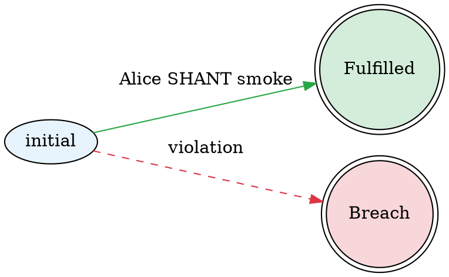

# State Graph REST API

The decision service now exposes state transition graphs extracted from L4 regulative rules (MUST/MAY/SHANT) via REST endpoints.

## Overview

State graphs visualize contract automata following the Flood & Goodenough "Contract as Automaton" model. Each regulative rule becomes a state machine with:

- **States**: Initial, Intermediate, Fulfilled (terminal success), Breach (terminal failure)
- **Transitions**: Labeled with party, deontic modal (MUST/MAY/SHANT), action, deadline, guards
- **Visual conventions**:
  - Success paths (HENCE) in green, solid
  - Failure paths (LEST/timeout) in red, dashed
  - Terminal states as double circles

## Endpoints

All state graph endpoints are scoped under `/functions/{functionName}/state-graphs`.

### List All State Graphs

```
GET /functions/{functionName}/state-graphs
```

Returns a list of all state graphs extracted from the module containing the specified function.

**Response:**
```json
{
  "graphs": [
    {
      "graphName": "noSmoking",
      "graphDescription": null
    },
    {
      "graphName": "weddingceremony",
      "graphDescription": null
    }
  ]
}
```

### Get State Graph as DOT

```
GET /functions/{functionName}/state-graphs/{graphName}
```

Returns the raw GraphViz DOT source for the specified state graph.

**Response:** `text/plain` (DOT format)

**Example:**
```
GET /functions/mycontract/state-graphs/noSmoking
```

Returns:


### Get State Graph as SVG

```
GET /functions/{functionName}/state-graphs/{graphName}/svg
```

Renders the state graph as an SVG image.

**Response:** `text/plain` (SVG XML)

**Requirements:** GraphViz must be installed and `dot` command available in PATH.

### Get State Graph as PNG

```
GET /functions/{functionName}/state-graphs/{graphName}/png
```

Renders the state graph as a PNG image.

**Response:** `application/octet-stream` (PNG binary)

**Requirements:** GraphViz must be installed and `dot` command available in PATH.

## Usage Examples

### Using curl

```bash
# List all state graphs
curl http://localhost:8001/functions/myfunction/state-graphs

# Get DOT source
curl http://localhost:8001/functions/myfunction/state-graphs/noSmoking

# Get SVG (view in browser or save to file)
curl http://localhost:8001/functions/myfunction/state-graphs/noSmoking/svg > graph.svg

# Get PNG
curl http://localhost:8001/functions/myfunction/state-graphs/noSmoking/png > graph.png
```

### JavaScript/TypeScript

```typescript
// List graphs
const response = await fetch('/functions/mycontract/state-graphs');
const { graphs } = await response.json();

// Get SVG for display
const svg = await fetch('/functions/mycontract/state-graphs/noSmoking/svg')
  .then(r => r.text());
document.getElementById('graph').innerHTML = svg;

// Download PNG
const blob = await fetch('/functions/mycontract/state-graphs/noSmoking/png')
  .then(r => r.blob());
const url = URL.createObjectURL(blob);
window.open(url);
```

## Error Responses

- **404 Not Found**: Function or graph name doesn't exist
  ```json
  "Function not found: myfunction"
  "State graph not found: invalidname"
  "No compiled module found for function"
  ```

- **503 Service Unavailable**: GraphViz not installed (only for SVG/PNG endpoints)
  ```json
  "GraphViz 'dot' command not found in PATH. Install graphviz to enable image rendering."
  ```

## Integration with jl4-web

The jl4-web frontend can consume these endpoints to display state graphs alongside the ladder diagram visualizer:

1. Call `GET /state-graphs` after file upload to list available graphs
2. Display graph selector dropdown if multiple graphs exist
3. Fetch SVG and embed inline with pan/zoom controls
4. Auto-refresh when code changes

## Example L4 Files with Regulative Rules

These files from the codebase contain regulative rules that generate state graphs:

- `jl4/experiments/wedding.l4` - Traditional wedding vows formalized
- `jl4/examples/ok/prohibition.l4` - Simple SHANT rules
- `jl4/examples/ok/contracts.l4` - Chained obligations
- `jl4/experiments/patterns_and_idioms.l4` - Business contracts
- `jl4/experiments/safe-post.l4` - Investment agreements

## Testing the API Locally

See `test-state-graph-api.sh` for a comprehensive test script that:
1. Starts the decision service with wedding.l4
2. Uploads the function
3. Lists available state graphs
4. Fetches DOT/SVG/PNG for each graph
5. Validates responses

## OpenAPI/Swagger Documentation

The state graph endpoints are automatically included in the OpenAPI specification at:
```
GET http://localhost:8001/swagger.json
```

Operation IDs:
- `listStateGraphs`
- `getStateGraphDot`
- `getStateGraphSvg`
- `getStateGraphPng`

## Implementation Notes

- State graphs are extracted from the compiled module using `L4.StateGraph.extractStateGraphs`
- The same `compiledModule` used for function evaluation is reused (no separate compilation)
- GraphViz rendering reuses existing `Backend.GraphVizRender` infrastructure
- Follows same patterns as evaluation trace endpoints (`/evaluation/trace.png`, `/evaluation/trace.svg`)
