# JL4 Client RPC

LSP client functionality for JL4 that can be used by the various language clients / IDE extensions (e.g. VSCode, Monaco), as well as RPC functionality and message types (e.g. between the VSCode extension and the VSCode webview).

## Prelim sketch of Client-side RPC architecture

This hasn't been totally implemented yet, but will be done within the next few PRs.

Parts of the architecture --- or at least, the choices of names --- were inspired by Lean 4's client-side RPC.

The key desiderata here are as follows (and I'm probably not remembering all of them):

- We want an architecture that makes it easy to, e.g., add more custom request types --- this required some thought because we have two clients, jl4-web/Monaco and the VSCode extension with subtly different requirements, and because VSCode requires that communication with webviews be done over a further layer of RPC
- but at the same time, we also want to be able to use high-level, 'safe' interfaces where possible

This militiated in favor of (i) trying to use lower-level primitives / methods in the intermediate components in the above diagram --- e.g., the LadderBackendApi --- while (ii) adding some safety with higher-level interfaces at the source/sink parts of the architecture (e.g., L4Connection).

## How to add support for a custom LSP request on the client side

1. Make schemas / types for the request params and response payload
2. Add a `L4RpcRequestType` request type for the custom request under "Specific protocol extensions" in `custom-protocol.ts`
3. Add a high-level method to `L4Connection` class in `l4-connection.ts` that wraps over the LadderBackendApi instance's sendClientRequest method
4. Call that method from the viz frontend

## License

Apache License 2.0
