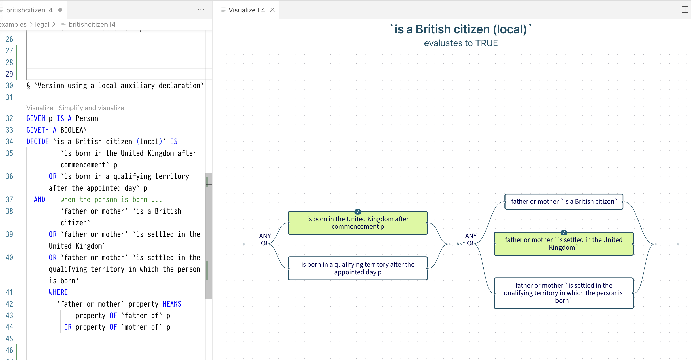
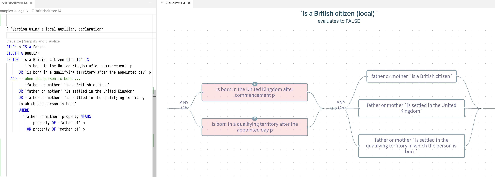
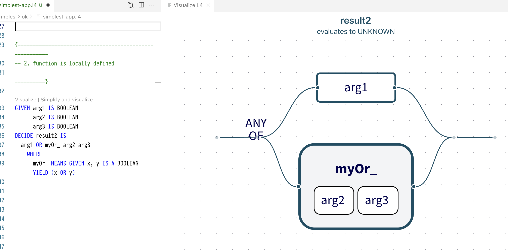
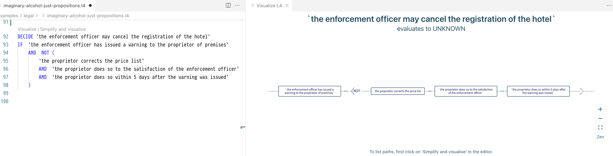
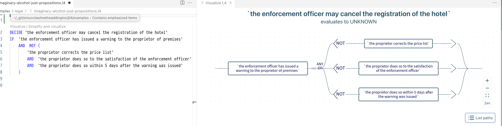
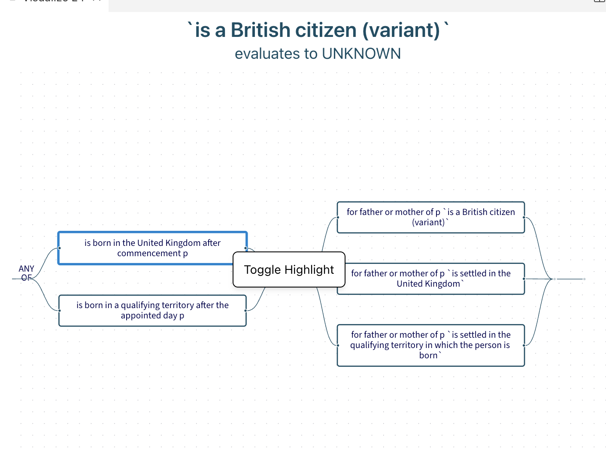
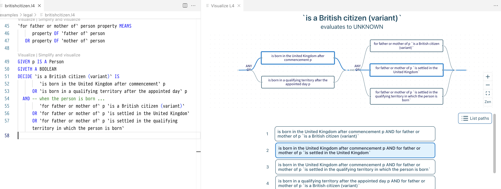
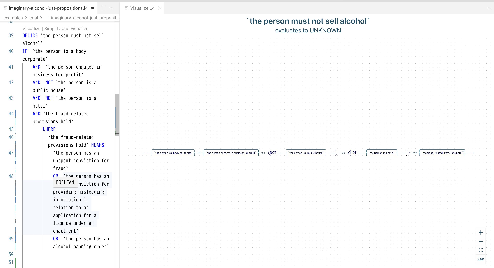
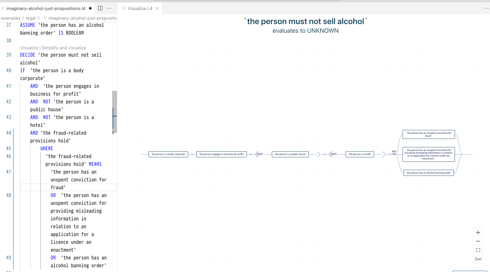

# README

What follows are developer-oriented docs, though I imagine that a non-developer should still be able to get quite a lot of them.

## What is the ladder visualizer?

At its core, the visualizer -- which is currently structured as a Svelte library -- takes a function declaration ([see the types at viz-expr](../viz-expr/viz-expr.ts)) as input and
visualizes the function as a 'ladder diagram', where each path through the graph corresponds to a way of making the visualized function true.

It also allows you to see what happens if, e.g., this or that expression is true or false, by clicking on the nodes accordingly.



For instance, in the above example, we see that `is a British citizen (local)`, when applied to the person `p`, is true if the person is born in the United Kingdom after commencement and if the predicate `is settled in the United Kingdom` holds of the person's father and mother.

This allows you to understand boolean functions by interactively changing the values of the various leaf propositions.

### A more detailed breakdown of the key features

#### Seeing what paths, what ways to make the function true, cease to be viable as you change your choices

We've talked about how you can see what the whole function evaluates to, given a possibly partial assignment of values to its constituent parts or sub-expressions.

But it's not just that --- you can also interactively see what paths cease to be viable, in light of your choices. For instance, if you indicate that the person is neither born in the United Kingdom after commencement nor born in the qualifying territory after the appointed day, all of the paths will fade out to indicate that there is no longer any way to make this function true --- there is no longer a way for this person to be a British citizen, at least not by the lights of how the function was defined.



### Evaluating expressions on the backend

(The following might not make much sense if you are not a developer --- apologies for that.)

The boolean expression evaluation happens on the frontend.
But evaluating things like function applications



happens on the backend, using the same evaluation engine that powers, e.g., the #EVAL functionality.
For more info, see the L4Connection and L4BackendApi parts of the codebase, as well as the Ladder backend.

### Simplifying or doing logical transformations on expressions and visualizing them (involves the backend)

If you have something with a complicated expression in the scope of a NOT like



you can simplify it by clicking on 'Simplify and visualize'.



Simplifying the expression also allows you to selct nodes or paths in the visualized graph.

### Selecting or highlighting nodes and paths

Suppose the expression of the function declaration is in negation normal form.
Then you can select nodes by right-clicking on them and clicking on 'Toggle Highlight'.



In the case of a NOT subgraph, you'd need to select it by selecting the `NOT <` node.

Once you've selected all the representative nodes in a path, the whole path will light up.



And as the above image demonstrates, you can also see a list of all the paths through the graph by clicking on 'List Paths'.

---

You can usually select paths either by selecting nodes
or by clicking on the paths in the paths list.
But note that the former is the main way to do it: the latter
is typically, but not always, possible.

(Homework for the reader: can you figure out why?)

### Inlining expressions

Finally, given something like



you can inline ('unfold to definition') the `the fraud-related provisions hold` boolean expression by clicking on the + icon.



(The icon might not always appear on auto-refresh; if so, please click again on 'Visualize'.)

## Key commands

```bash
npm run dev --open
```

You might need to build from the root dir when you've made changes to dependencies of the visaulizer.

Useful things to make into aliases / shortcuts:

```bash
cd <root-dir-of-this-mono-repo>
npm run format; turbo run lint test build check
// you could also add the cmd-line invocations for
// building the extension and opening it in vscode (or equivalently for jl4-web)
```

and

```bash
cd <visualizer dir>
npm run dev
```

Finally, I encourage you to use `corepack` if you run into issues with things like npm versions.

## How to use the visualizer library in another web app

### Easiest way: just make another app in this monorepo

The easiest thing to do is to make another Svelte app in the `ts-apps` dir of this monorepo,
with configs similar to the those of the other apps there (e.g. the vscode webview or jl4-web). And then just import the relevant lib(s)
from that app, in the same way that those other apps do (see, e.g., [the vscode webview +page.svelte](../../ts-apps/webview/src/routes/+page.svelte)).

It might also help to look at [the demo route in the visualizer package](../../ts-shared/l4-ladder-visualizer/src/routes/+page.svelte), especially if you plan to use stock or hard-coded examples.

Make sure to also see the discussion re the LSP server below.

### Other options

- [Make the visualizer package an 'external' package, in Turborepo's parlance, and deploy it to npm](https://turborepo.com/docs/guides/publishing-libraries).
  - Given the current setup / API, this will probably also require publishing the core Lir package, since the API currently requires consumers to set up and pass in the LirNode.
  - If you want to make it possible for consumers to opt out of using the Lir framework, you will need to extend the visualizer API accordingly. This is easy --- shouldn't require more than an hour of work; I just hadn't done it because the frontend architecture so far had been structured around using the Lir framework for our state synchronization needs, and because the priority had been on developing more features.
- If you also want to be able to use it _without_ using Svelte,
  - one option here might be to compile it to a 'custom element' or 'web component': https://svelte.dev/docs/svelte/custom-elements But do read the 'Caveats and Limitations' section of that link.
  - There might also be other options: this is not something I know a lot about.

### How to use the visualizer library without the LSP server and Ladder backend

The visualizer currently is integrated with the LSP server and Ladder backend.
It does _not_ currently expose a nice, type-safe API for using it without the backend,
but a hack-y way to do that would be to just avoid using things that would enable the sorts of functionality that the integration with the LSP and backend uses.
For instance, don't use the App variant of IREXpr and don't set `canInline` to true.

The less hack-y way is to add an additional API for this usecase. This shouldn't require much work since the relevant parts of the codebase are quite modular and explicitly named and designed.

## Notes on dependency-related things / errors / decisions

### Make sure that SF nodes don't try to render and measure themselves in a non-browser environment (e.g. if SSR is enabled)

### esbuild x vite

`esbuild` was added as a direct dependency, with a pinned version,
because I was running into https://github.com/evanw/esbuild/issues/3800
after upgrading `vite`.

## Useful prior art

### Svelte components for VSCode webviews

https://github.com/bscotch/stitch/tree/develop/packages/vscode/webviews

### Layout x xyflow

- An elkjs example featuring subflows that seems easier to understand than the sample code: https://codesandbox.io/p/sandbox/elkjs-layout-subflows-9og9hl?file=%2Flayout.js

## License

Apache License 2.0
